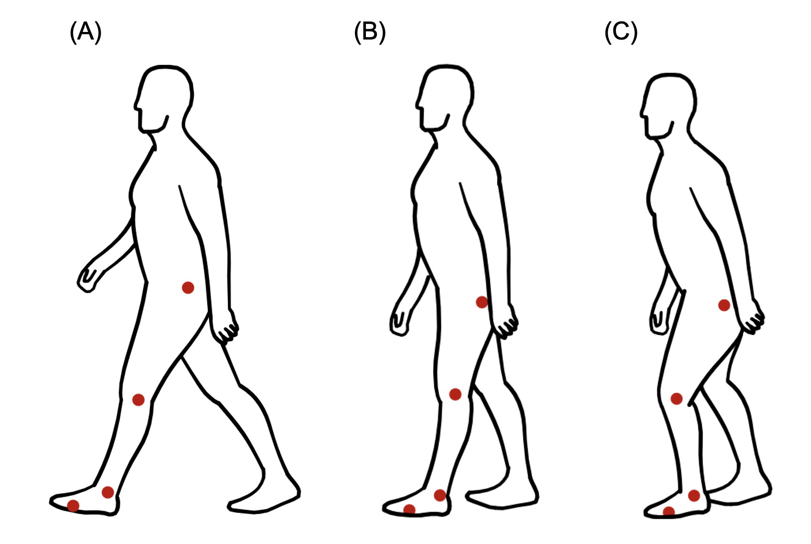

# 2D Smartphone-Based Gait Analysis System

A low-cost, marker-based smartphone system for distinguishing normal and pathological gait patterns.


## Table of Contents
- [Description](#description)
- [Key Findings](#key-findings)
- [Installation](#installation)
- [Usage](#usage)
- [Repository Structure](#repository-structure)
- [Results](#results)
- [Clinical Applications](#clinical-applications)
- [Full Dissertation](#full-dissertation)
- [Contributing](#contributing)
- [Credits](#credits)
- [License](#license)

## Description

**What does this project do?**
This project demonstrates that a smartphone-based marker system can effectively detect and quantify differences between normal and simulated pathological gait patterns, achieving 94.4% accuracy in distinguishing between normal, limping, and Parkinsonian gait conditions.

**Why did I build this project?**
Traditional gait analysis systems cost tens of thousands of pounds and require specialised laboratory settings, making quantitative gait assessment inaccessible to many clinics and research facilities. This project bridges the gap by creating an affordable alternative that maintains clinical-grade accuracy.

**What problem does it solve?**
- Makes quantitative gait analysis accessible to resource-limited settings
- Provides objective measurements vs. subjective observational assessments
- Enables early detection of neurological conditions like Parkinson's disease
- Offers a portable solution for rehabilitation monitoring

**What did I learn?**
- Developed expertise in computer vision and marker tracking algorithms
- Gained deep understanding of biomechanics and gait analysis
- Learned to create robust statistical models for medical data
- Strengthened knowledge of R programming for complex data analysis and visualisation

**What makes this project stand out?**
- **99% cost reduction** compared to traditional motion capture systems
- **94.4% classification accuracy** using machine learning
- **Complete custom software framework** built from scratch in R
- **Clinical validation** with measurable kinematic and spatiotemporal parameters

## Key Findings

- **Reduced joint mobility**: Parkinsonian gait showed 36% less knee range of motion than normal gait
- **Compensatory mechanisms**: 31% shorter stride length compensated by 42% higher cadence in Parkinsonian gait
- **High measurement consistency**: Normal gait showed 5-8% coefficient of variation
- **Speed-dependent changes**: System successfully captured gait adaptations across multiple walking speeds

## Installation

### Prerequisites
- R (version 4.0 or higher)
- iPhone 7 or newer with 60 fps video capability
- 4x white spherical markers (40mm diameter)
- Tripod or stable camera mount

### Required R Packages
```r
install.packages(c(
  "av",
  "tidyverse", 
  "ez",
  "rstatix",
  "effectsize"
))
```

### Hardware Setup

1. Mount smartphone 3 meters from subject at hip height
2. Attach markers to anatomical landmarks (as shown in image above for each gait: A) Normal; B) Limping; C) Parkinsonian) :
   - Greater trochanter (hip)
   - Lateral femoral epicondyle (knee)
   - Lateral malleolus (ankle)
   - Fifth metatarsal head (foot)
3. Ensure dark, contrasting background for optimal marker detection

## Usage

### Quick Start

**⚠️ Important Note:** This repository contains the analysis code and framework, but the original video data (.MOV files) cannot be shared due to participant confidentiality and ethical considerations.

#### To Use This Code:
1. **Clone the repository:**
```bash
git clone https://github.com/MichaelLeighton/2D-Gait-Analysis-System.git
cd 2D-Gait-Analysis-System
```

2. **Collect your own data** following the protocol described in the [Data Collection Protocol](#data-collection-protocol) section

3. **Run individual subject analysis first:**
```r
# Step 1: Process individual condition videos for each subject
source("S2_2_5_PD.R")          # Subject 2, 2.5 km/h, Parkinsonian gait
source("S2_2_5_limp.R")        # Subject 2, 2.5 km/h, limping gait
source("S2_2_5_normal.R")      # Subject 2, 2.5 km/h, normal gait
# ... repeat for all 9 conditions per subject (3 speeds × 3 gait types)

# Step 2: Consolidate each subject's data
source("S2_complete_analysis.R")   # Consolidates all S2 conditions
source("S3_complete_analysis.R")   # Consolidates all S3 conditions
source("S4_complete_analysis.R")   # Consolidates all S4 conditions
source("S5_complete_analysis.R")   # Consolidates all S5 conditions
```

4. **Run the collective analysis:**
```r
# Step 3: Analyse all subjects together
source("Collective Gait Analysis.R")   # Cross-subject statistical analysis
```

#### Alternative: Study the Framework
If you want to understand the methodology without collecting new data:
- Review the code structure and algorithms
- Examine the analysis pipeline in each script
- Read the full dissertation for detailed results and validation

### Data Collection Protocol

**Note:** Original video data from this study cannot be shared due to ethical and privacy considerations. To use this system, you will need to collect your own data following this protocol:

1. **Setup Requirements:**
   - Record 10-second videos at 60 fps for each condition
   - Test multiple walking speeds (2.5, 4, 5.5 km/h recommended)
   - Place 4 white spherical markers on anatomical landmarks
   - Maintain 3-metre camera distance at hip height

2. **Video File Naming Convention:**
   ```
   S[subject]_[speed]_[condition].MOV
   Examples: S2_2_5_PD.MOV, S3_4_normal.MOV, S4_5_5_limp.MOV
   ```

3. **Required Recordings per Subject:**
   - 3 speeds × 3 conditions = 9 videos per participant
   - Include familiarisation periods between trials
   - Maintain consistent lighting and camera positioning

4. **Data Processing:**
   Each video file requires a corresponding R script following the naming pattern:
   - `S[subject]_[speed]_[condition].R`
   - Scripts process individual videos through the marker detection pipeline
   - Results are then fed into the collective analysis

### Analysis Pipeline

The system processes data through three main stages:
1. **Video Processing**: Frame extraction and marker detection
2. **Tracking**: Nearest-neighbor algorithm with anatomical constraints  
3. **Parameter Calculation**: Joint angles, stride metrics, and classification

### Expected Output
- Kinematic parameters (joint angles, range of motion)
- Spatiotemporal metrics (stride length, cadence, stance phase)
- Statistical comparisons between gait conditions
- Visualisation plots and classification results

## Repository Structure

```
├── images/
│   ├── markers.png
│   └── workflow_diagram.png
├── Collective Gait Analysis.R          # Cross-subject statistical analysis
├── S2_2_5_PD.R                         # Individual condition scripts
├── S2_2_5_limp.R                       #   ↳ Process single video files
├── S2_2_5_normal.R                     #   ↳ (36 total: 9 per subject × 4 subjects)
├── S2_4_PD.R                           #
├── [...other individual conditions]    #
├── S2_complete_analysis.R              # Subject consolidation scripts
├── S3_complete_analysis.R              #   ↳ Combine all conditions per subject
├── S4_complete_analysis.R              #   ↳ (4 total: one per subject)
├── S5_complete_analysis.R              #
├── .gitignore                          # Excludes large data files (.MOV, .rds, etc.)
├── README.md                           # This documentation
└── [Video files not included]          # .MOV files excluded for privacy
```

**Analysis Workflow:**
1. **Individual condition scripts** (e.g., `S2_2_5_PD.R`): Process single video files through marker detection pipeline
2. **Subject consolidation scripts** (e.g., `S2_complete_analysis.R`): Combine all 9 conditions for each subject 
3. **Collective analysis** (`Collective Gait Analysis.R`): Statistical analysis across all subjects

**File Descriptions:**
- `Collective Gait Analysis.R`: Main script performing cross-subject statistical analysis *(requires consolidated subject data)*
- `S[X]_complete_analysis.R`: Subject-level consolidation scripts that combine all conditions for each participant
- Individual condition files (e.g., `S2_2_5_PD.R`): Process specific video files *(requires corresponding .MOV files)*
- **Missing data**: Original .MOV video files are not included due to participant confidentiality

## Results

### Performance Metrics
| Gait Condition | Knee ROM (°) | Stride Length (m) | Cadence (steps/min) | Classification Accuracy |
|----------------|--------------|-------------------|---------------------|----------------------|
| Normal         | 57.5-64.5    | 1.01-1.44         | 43.5-65.4          | 91.7%               |
| Limping        | 39.1-50.9    | 0.94-1.39         | 45.0-70.5          | 100%                |
| Parkinsonian   | 36.6-51.0    | 0.68-1.04         | 63.0-93.0          | 91.7%               |

### System Validation
- **Marker tracking success rate**: 100% across all experimental conditions
- **Cross-validation accuracy**: 94.4% [81.3-99.3% CI]
- **Measurement reliability**: CV 5-8% for normal gait parameters
- **Speed adaptation**: Successful detection across 2.5-5.5 km/h range

## Clinical Applications

### Immediate Uses
- **Neurological assessment**: Early detection of movement disorders
- **Rehabilitation monitoring**: Objective progress tracking
- **Research applications**: Cost-effective data collection
- **Educational purposes**: Biomechanics teaching and demonstration

### Target Settings
- Outpatient clinics without motion capture labs
- Rehabilitation centers
- Community health settings
- Research institutions with limited budgets
- Home-based assessment programs

### Advantages Over Traditional Systems
- **Accessibility**: No specialised lab required
- **Cost-effective**: Under £1000 vs £10,000+ traditional systems
- **Portability**: Can be used in various environments
- **User-friendly**: Minimal technical training required

## Full Dissertation

📄 **[Read the Complete Dissertation](./Leighton_2025_Gait_Analysis_Dissertation.pdf)**

The full academic paper provides comprehensive details on:
- **Methodology**: Detailed experimental protocol and data collection procedures
- **Literature Review**: Context within existing gait analysis research
- **Statistical Analysis**: Complete statistical methods and validation procedures
- **Discussion**: Clinical implications and future research directions
- **Appendices**: Additional figures, data tables, and technical specifications

**Citation:**
```
Leighton, M. (2025). A Low-Cost 2D Marker-Based Smartphone System for 
Distinguishing Normal and Simulated Pathological Gait. MSc Health Data Science 
Dissertation, Swansea University.
```

## Contributing

This project was developed as academic research. While the current version represents completed dissertation work, contributions for future development are welcome:

### How to Contribute
1. Fork the repository
2. Create a feature branch (`git checkout -b feature/improvement`)
3. Commit your changes (`git commit -am 'Add new feature'`)
4. Push to the branch (`git push origin feature/improvement`)
5. Create a Pull Request

### Areas for Future Development
- Integration with additional smartphone platforms
- Machine learning model improvements
- Clinical validation with patient populations
- Real-time analysis capabilities
- Integration with wearable sensors

## Credits

### Academic Supervision
- **Dr. Owen Bodger** - Primary Supervisor, Swansea University

### Institution
- **Swansea University** - MSc Health Data Science Program

### Research Context
This work was completed as part of the MSc Health Data Science dissertation requirements at Swansea University. The research contributes to the growing field of accessible healthcare technology and quantitative movement analysis.

### Study Participants
Special thanks to the four volunteers who participated in this study and made this research possible.

### Inspiration and References
This project builds upon decades of gait analysis research and recent advances in smartphone-based motion capture technology. Key literature and methodological approaches are detailed in the accompanying dissertation document.

## License

This project is part of academic research conducted at Swansea University Medical School. 

**For Academic Use:**
- Citation required when using or referencing this work
- Modifications and improvements welcome with proper attribution
- Educational and research use encouraged

**For Commercial Use:**
- Please contact the author for permissions and licensing arrangements

### Citation
If you use this work in your research, please cite:
```
Leighton, M. (2025). A Low-Cost 2D Marker-Based Smartphone System for 
Distinguishing Normal and Simulated Pathological Gait. MSc Dissertation, 
Swansea University.
```

---

**Contact Information:**
For questions, collaborations, or technical support, please open an issue in this repository or contact through the repository owner's profile.

**Academic Context:**
This project represents the culmination of MSc Health Data Science studies, demonstrating the practical application of data science techniques to solve real-world healthcare challenges.
